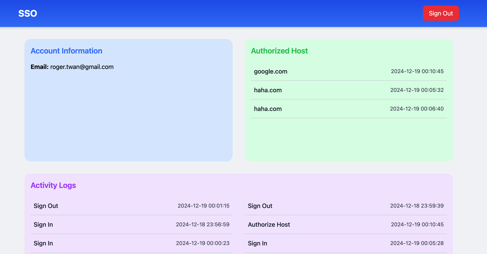

# SSO
An SSO (Single Sign-On) System Implemented with Java Spring MVC.  


## Screenshot


## Development
### Configuration
Duplicate the `application-template.properties` file to `application-active.properties`, then add your own configurations.

```properties
spring.application.host=http://localhost:8080
spring.application.name=sso
spring.thymeleaf.prefix=classpath:/templates/
spring.thymeleaf.suffix=.html
spring.thymeleaf.mode=HTML
spring.thymeleaf.encoding=UTF-8
spring.jpa.hibernate.ddl-auto=update
spring.jpa.show-sql=true
spring.datasource.url=jdbc:mysql://
spring.datasource.username=
spring.datasource.password=
spring.mail.properties.mail.smtp.auth=true
spring.mail.properties.mail.smtp.starttls.enable=true
spring.mail.host=
spring.mail.port=
spring.mail.username=
spring.mail.password=
spring.mail.test.receiver=
jwt.secret-key=
spring.redis.host=
spring.redis.port=6379
spring.redis.password=
playwright.headless=true
spring.token.expiration.verification.minutes=5
spring.token.expiration.auth.days=3
```

### Commands
```bash
# Start server: http://localhost:8080
mvn spring-boot:run

# Test
mvn test
```

## Document
Visit [here](https://roger.ink/blog/SSO%20-%20Single%20Sign%20On) to learn more about SSO and the system architecture design.
